# Data Security: Banks Outsourcing Data to Public Cloud

## 1. System Overview

### 1.1 System Architecture

#### 1.1.1 Brief Introduction
In this project, we developed a data outsourcing system to help banks upload and download data safely from public cloud with an encryption algorithm called Decentralized Ciphertext Policy Attribute Based Encryption schema (DCPABE). The system architecture diagram is shown below and the other parts in 2.1 will explain this diagram from different aspects.
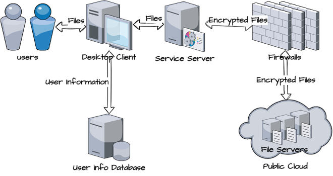

Figure 1. System Architecture

#### 1.1.2 Architecture Patterns
We use client server (C-S) pattern together with MVC pattern in this project.
C-S architecture is a model used to design computer apps/services, divided into client and server parts. The client runs on the user's device, sends requests to the server, and presents data/functionality to the user. The server runs on a remote computer, processes requests, stores data, and provides services.
MVC is a software architecture pattern that divides an application into three parts: the Model, View, and Controller. The Model is responsible for managing and processing data, the View for presenting data and interaction elements, and the Controller for connecting the Model and View, handling user interaction, and updating the View.
In our project, the view layer is on the client desktop while the model and controller part are on the service server.
We use such patterns for several reasons.
-	Separation of concerns, making it easy to code, maintain, extend and integrate;
-	Improved code reusability;
-	Security, since the client part all in the intranet of the bank

#### 1.1.3 Components and modules
- **User info Database**: The database stores the information of all the users such as username, password, attributes of users and so on.
- **Desktop Client**: The client is run on the desktop in the intranet of the bank. Focusing on the interaction with the user, it has a Graphical User Interface (GUI) which contains instructions and hints to make it user-friendly.
- **Service Server**: Encrypt and decrypt the files with attribute-based access control.
- **Firewalls**: The firewall of the banking system, to protect from cyber-attacks.
- **File Servers on public cloud**: Store the encrypted files.

#### 1.1.4 Interactions and dependencies
As shown in the diagram, the interactions between each node are the user information or the Files (undecrypted t or encrypted version). We keep all the undecrypted Files only shown in the intranet of the banks, and the Encrypted Files are transported between the services server and the public cloud servers. The Firewalls of the bank system can protect our system from cyber-attacks.
#### 1.1.5 Technology Selection
- **Client part**: java and fxml
- **Server part**: java
- **Database**: mysql
- **Public Cloud Server**: AWS

#### 1.1.6 Non-functional Requirements
Documents type: in demo, we just show the encrypt and decrypt of txt files, actually our system can deal with all kinds of files in the computer systems.
#### 1.1.7 Deployment
We deploy our client and service server on one desktop at present and the public cloud service provider we choose is AWS.
#### 1.1.8 Evolution and Iteration
At present, our system just keeps the necessary part for demo and proof of program correctness. In the future, we can make some simple adjustments to make this outsourcing system integrated with the ERP or other systems in the banks.
### 1.2 Existing method
Today, most banks simply outsource non-sensitive data to the public cloud, and most complex sensitive data can still only be handled using the bank's own private cloud. Banks are shifting to public cloud services to reduce expenses, store more data, and improve efficiency with the advancements in financial technology. This project aims to address the risk of security vulnerabilities as the cloud service provider is not fully trusted by providing practical, secured and scalable cloud services for banks. (Nikita, 2021)
In our project, we used the Attribute-Based Access Control (ABAC) model. The ABAC model is an authorized access model and is able to evaluates attributes to determine the access right. Under the ABAC mechanisms, various subject, resource, action and environment will constitute a combination of characteristics and values. Then, the system would determine which access request is valid according to the rules, and protect data from unauthorized users and actions at the same time. (Coffey and Alisa, 2019)
Applying this model, banks can output the policy decision point and policy enforcement point by input subject, subject attribute, environment conditions, resource object attributes and access control rules. Compared to role-based access control model and other models, ABAC model has more complex parameters, more specific system monitoring and can provide superior security and privacy.

### 1.3 Business model
Our project aims to provide a secure and cost-effective solution for banks to outsource their data to the public cloud.
- Data Classification Policy:
    - The first step is for the bank to establish a data classification policy that defines sensitive and non-sensitive data. This policy should be based on the bank's risk assessment and compliance requirements.
- Attribute-Based Access Control (ABAC):
    - The bank will implement attribute-based access control (ABAC) to manage access to sensitive data in the public cloud. ABAC enables the bank to define access policies based on attributes such as user role, location, and time.
- Attribute Mapping:
    - The bank will map the attributes used in ABAC to the bank's data classification policy. This mapping will ensure that access policies are consistent with the sensitivity of the data.
- Encryption:
    - The bank will encrypt sensitive data before uploading it to the public cloud. The encryption keys will be managed by the bank and only authorized users with the appropriate attributes will have access to the decrypted data.
- Cloud Service Provider (CSP) Integration:
    - The bank will integrate with one or more public cloud service providers (CSPs) that support ABAC. This integration will enable the bank to manage access to its data in the cloud using its existing ABAC policies.
- User Management:
    - The bank will manage user access to its data in the public cloud using its existing user management systems. Users will be granted access based on their attributes and the bank's ABAC policies.
- Monitoring and Reporting:
    - The bank will monitor access to its data in the public cloud to ensure compliance with its ABAC policies. The bank will also generate reports on access patterns and user behavior to identify potential security threats.
- Continuous Improvement:
    - The bank will continuously review and improve its ABAC policies to ensure that they remain effective in managing access to its data in the public cloud.

## 2. Introduction
As a component of their digital transformation, numerous financial institutions have transferred some of their data and applications to the public cloud. Public cloud providers, such as Amazon Web Services (AWS), Microsoft Azure, and Google Cloud Platform (GCP), offer diverse benefits to banks, including cost efficiency, heightened scalability, and expedited service and application deployment. As per McKinsey, over 60% of banks intend to relocate the majority of their operations to the public cloud within the next five years to remain competitive and lucrative (McKinsey, 2020).
Nonetheless, banks typically restrict the utilization of public cloud to non-essential data and applications, owing to persistent concerns regarding the security of sensitive financial information in the public cloud. Banks are also subject to stringent regulations, such as the General Data Protection Regulation (GDPR) and Payment Card Industry Data Security Standards (PCI DSS), which can impede their ability to fully capitalize on public cloud services.
Effectual data security entails data access control, encryption measures, key management, cyber incident response, and contingency plans for unexpected server outages, among other things. Encryption is a validated technique for safeguarding sensitive data and is mandated by several regulations. By encrypting sensitive data prior to uploading it to the cloud, an additional layer of security is provided, protecting the data from unauthorized access or theft, even if the data is compromised. This approach enables banks to leverage the advantages of public cloud services while still ensuring the security of their sensitive data.
### 2.1 Background 
Financial institutions are transitioning towards public cloud services to curtail expenses, store larger volumes of data, and enhance operational efficiency through technological advancements. Public cloud services offer several benefits, including cost reduction, expedited deployment, boundless storage capacity, enhanced security, and disaster recovery capabilities. Nevertheless, security vulnerabilities remain a concern as the cloud service provider is not entirely dependable, which this endeavor endeavors to rectify by furnishing practical, fortified, and scalable cloud services for financial institutions. (Nikita, 2021)
The objective of this initiative is to tackle the aforementioned security concerns surrounding the utilization of public cloud services for financial institutions. To achieve this, the project aims to offer practical, fortified, and scalable cloud services that cater specifically to the needs of banks. These cloud services will be designed with a multi-layered security approach, which will include robust data access controls and encryption measures, key management protocols, cyber incident response plans, and contingency measures for unexpected server outages. Furthermore, the cloud services will be scalable to accommodate the growing data storage requirements of banks, while concurrently maintaining the highest level of security at all times. By providing such cloud services, financial institutions can confidently leverage the benefits of public cloud services, without compromising the security of their sensitive financial data.
### 2.2 Objective
In this project, we developed a data outsourcing system to help banks upload and download data safely from public cloud with an encryption algorithm called Decentralized Ciphertext Policy Attribute Based Encryption schema (DCPABE). The system architecture diagram is shown below and the other parts in 2.1 will explain this diagram from different aspects.

## 3. Methodology

### 3.1 Proposed Method

#### 3.1.1 attribute-based access control
In this project, we use attribute-based access control as our core technology, it is an authorized access model which evaluates attributes to determine the access right and it is also a robust and flexible cryptographic technique. Compared to the Role Based Access Control model, attribute-based access control has far more complex parameters. That means it can provide superior security and privacy, and the permission management will also be more granular.
More detail, when we move sensitive data to public cloud, data will be encrypted using a unique set of attributes defined by the data owner, data owner can use “AND”, “OR” gate to define access policy.
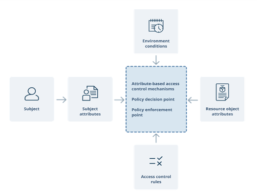

#### 3.1.2 Technical Design
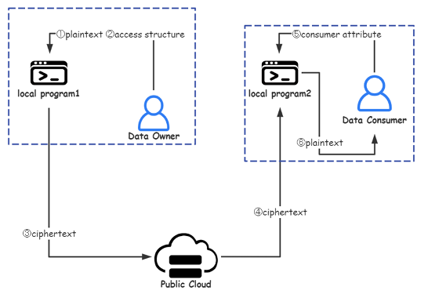
In the system, there are 3 parties, the data owner, data consumer and public cloud service provider. Before up load the data to the cloud, data owner need to design the access policy. Then data will be encrypted by a symmetric encryption algorithm which named AES, and the key will be encrypted by attribute based encryption with the access policy. When data consumer request for data, the public cloud will send the encrypted data to them. Only when the consumer’s attributes are satisfied with the access policy, the encrypted data can be decrypted successfully.
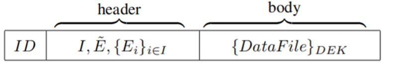
This is the format of data stored on the cloud, the body part is the data encrypted by DEK, and in the header, we store the access policy and encrypted the DEK by these access policy.
#### 3.1.3 Workflow
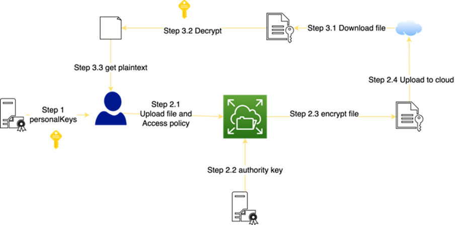
Here’s the workflow in our system, first we distribute personal keys based on their attributes, then user need to login and do necessary authentication. After login, data owner can upload data to the cloud and others consumer can download the data they need from the public cloud.

##### 3.1.3.1 Distribute Personal Keys and authentication
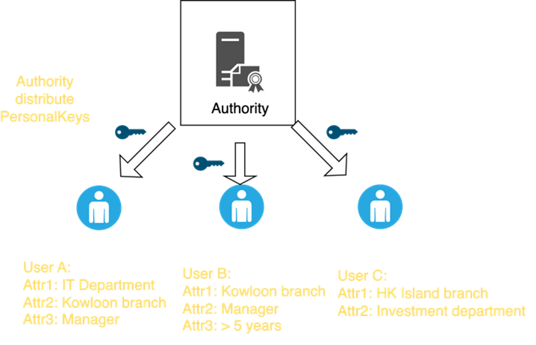
First we need to distribute the personal keys to the data consumer, which granted their data access permissions, we use function Attr1_key(userid, attr1) to realize it. Then user need to input their username and password. In the backend, we will compare the input with the record in database, if consistent, users login request will be allowed.

##### 3.1.3.2 Upload Data
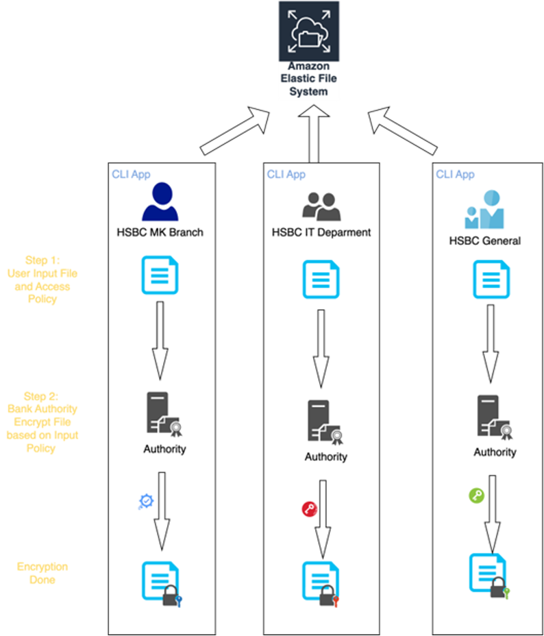

##### 3.1.3.3 Download Data
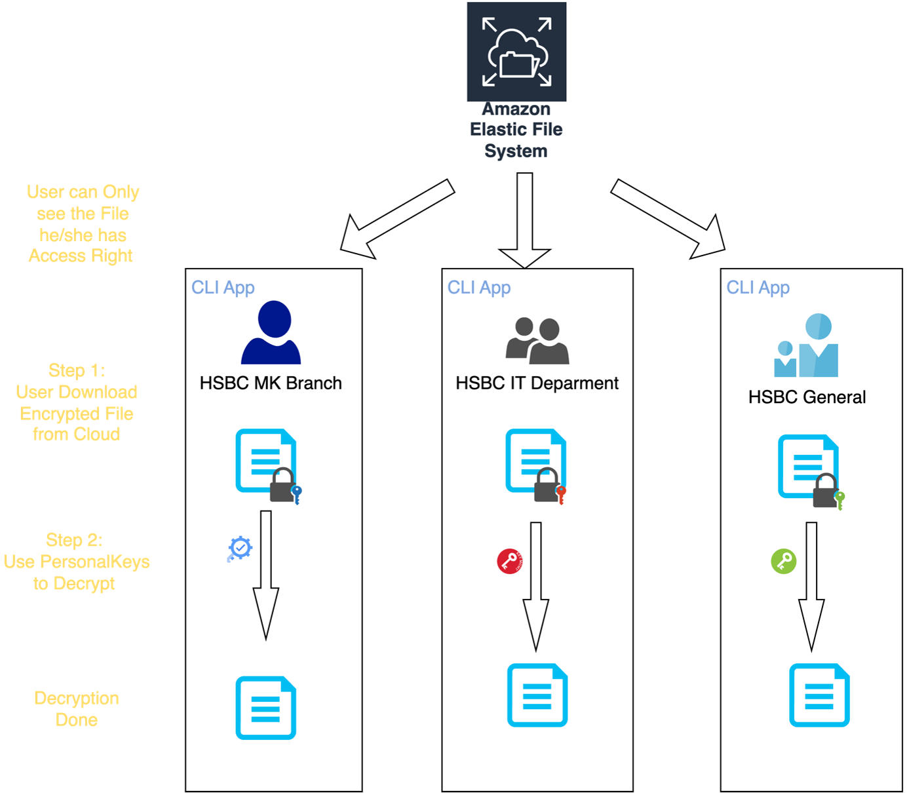

## 4. Performance

### 4.1 Implementation
The implementation of our project has been carried out in a systematic and phased manner to ensure a seamless transition for financial institutions adopting our secure and efficient cloud solution.

#### 4.1.1 Data Classification and Policy Creation
Initially, banks develop a data classification policy to categorize sensitive and non-sensitive data based on their risk assessment and compliance requirements. This step lays the foundation for implementing robust access control mechanisms.

#### 4.1.2 Attribute-Based Access Control Implementation
Next, banks implement attribute-based access control (ABAC) to manage access to sensitive data in the public cloud. This involves defining access policies based on user attributes, such as role, location, and time, providing a fine-grained control over data access.

- initialize()
  - We initializes secure data sharing system via this function initialize(). The main objective of the function is to set up encryption keys for users based on their attributes, which will be used for secure access control in a cloud-based environment.   The function starts by reading global parameters (gp) and initializing data structures for user keys, authority keys, and authority attributes. It then reads the "authority.txt" file to set up authorities with their respective attributes and generates corresponding authority keys using the DCPABE.authoritySetup method. Different attributes may belong to different CAs. Therefore we support multiple CAs. For example, the CA of the company's human resources department is responsible for the attribute related to position, and the CA of the headquarters is responsible for the attribute related to location.   Next, the function reads the "user_attr.txt" file to load user information and their attributes. For each user, the function generates personal keys based on the user's attributes and associated authority keys using the DCPABE.keyGen method. The generated personal keys are stored in a "userKeysMap" hashmap.   Finally, the function saves the generated personal keys for each user to individual files in the "src/main/resources/priv/sr/crypto/user/" directory. These keys can later be used for encryption and decryption in a secure access control system based on user attributes.                                                                                                                                                                                                                                                                                                                                                                                                                                                                                                                                                                                                                                                                                                                                                                                                                                                                                                                                                                                                                                                                                                                                                                                                                                                                                                                                                                                                                                                                                                               |
    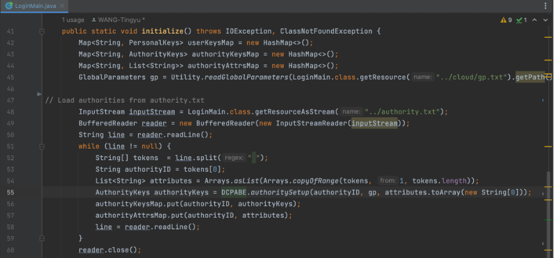
    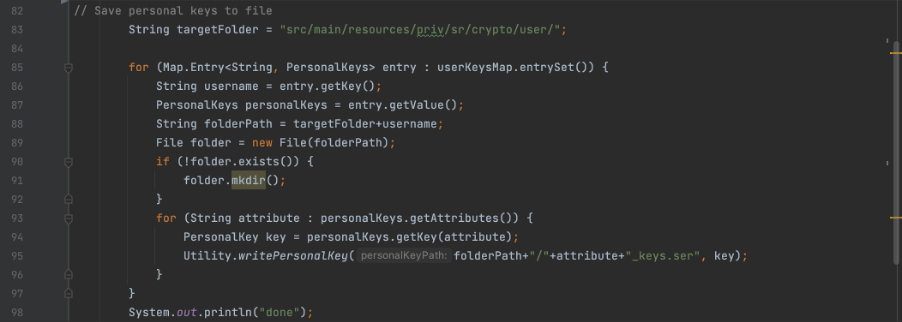
  - authority.txt example:
    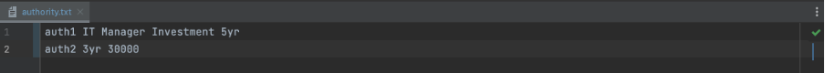
  - user_attr.txt example:
    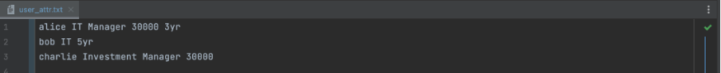
  - User’s key generated:
    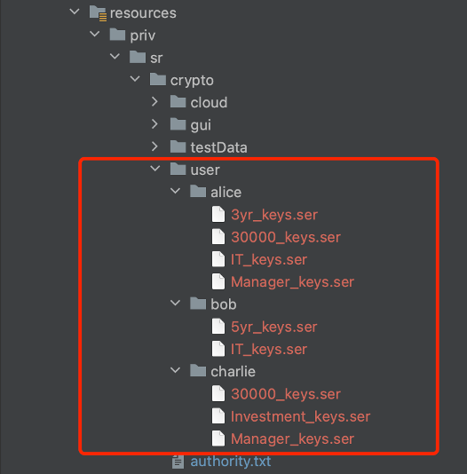

- User Guide
  - Once the user successfully inputs their username and password, they will be directed to the homepage. At this point, the user will assume two roles simultaneously, namely DO (data owner) and user (data user). This allows users to have the option of uploading data and downloading authorized data access as they wish.
  - Login Page:
  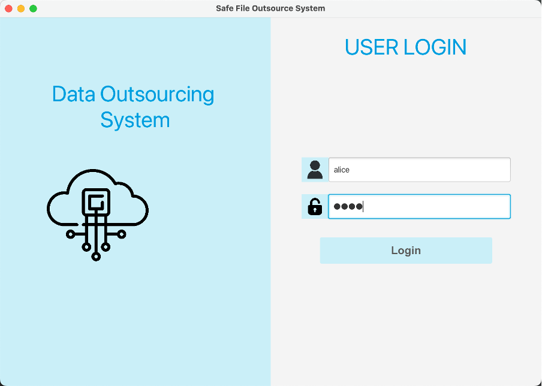
  - Home Page:
  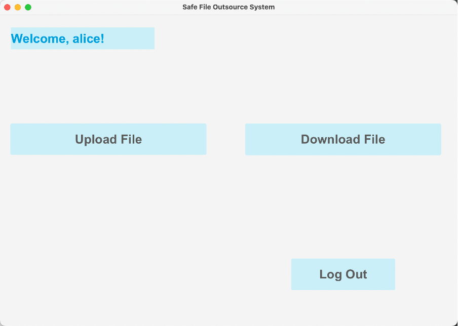
  - Upload Page:
  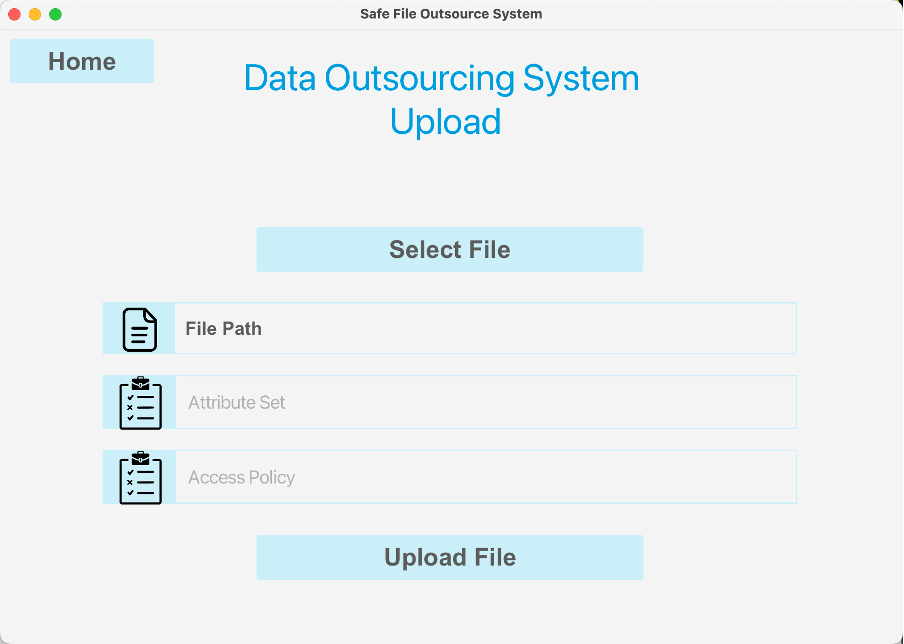
    - We can handle all type of input file. (.txt, .csv, .pptx and etc)
    - Attribute set is about the CA.
    - Option authority in our sample: auth1 auth2
    - Optional access policy: and IT or Manager 5yr
    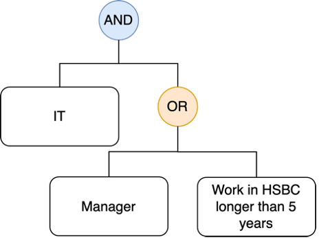
    - i.e. You must belong to IT department, and should be manager or seniority longer than 5 years, then you have the access right for this specified file.
                                                                                                                                                                                                                                                                                                                                                                                                                                                                                                                                                                                                                                                                                                                                                                                                                                                                                                                                                                                                                                                                                                                                                                                                                                                                                                                                                                                                                                                                                                      
#### 4.1.3 Encryption and Decryption
Banks then employ our encryption tool to protect sensitive data before uploading it to the public cloud. The tool ensures that encryption keys are securely managed by the bank and that only authorized users with the appropriate attributes can access the decrypted data.

- encrypt()
  - In the DO class, the 'encrypt' method encrypts a file using a given policy. It builds an access structure from the policy, reads the file, and encrypts it using the DCPABE.encrypt method. The encrypted file is then saved with the ".enc" extension.
    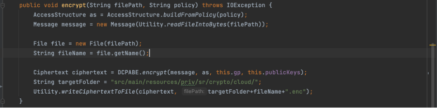
- decrypt()
  - In the User class, the 'decrypt' method decrypts an encrypted file for a user. It reads the ciphertext file, decrypts it using the DCPABE.decrypt method, and saves the decrypted content. The decrypted content is then saved within target folder.
    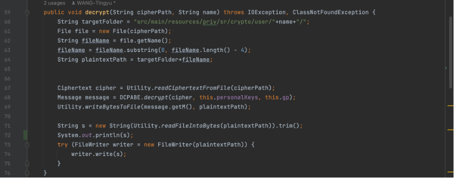
- encrypt() and decrypt() in DCPABE class
  - The DCPABE class contains the core encryption and decryption methods. The 'encrypt' method generates a ciphertext using an access structure, global parameters, and public keys. The 'decrypt' method takes a ciphertext, personal keys, and global parameters to recover the original message. If the user does not satisfy the access policy, an exception is thrown.
  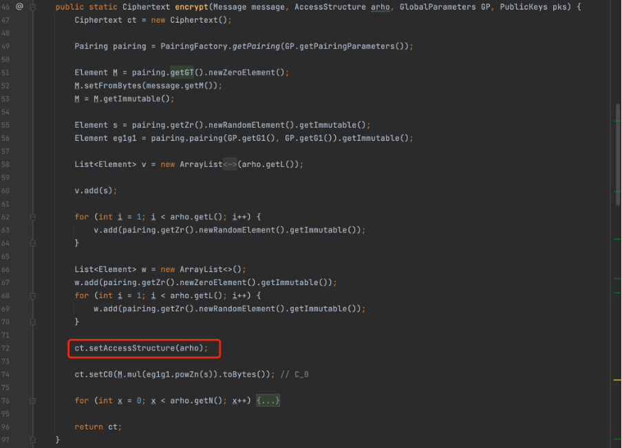
  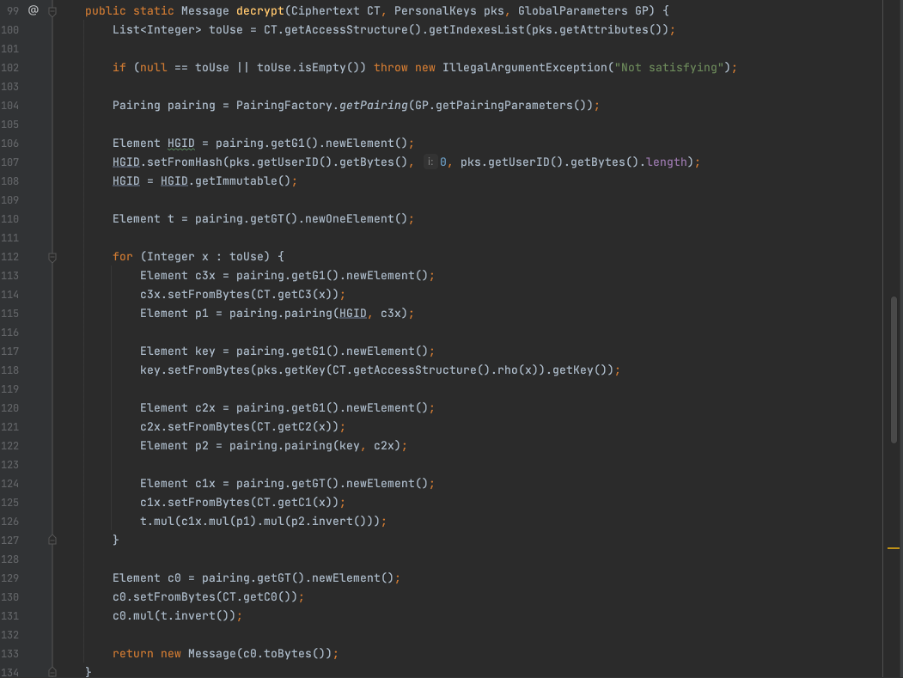
#### 4.1.4 Integration with Cloud Service Providers
After encryption, banks integrate their systems with one or more public cloud service providers (CSPs) that support ABAC. This integration enables them to manage access to their data in the cloud using their established ABAC policies.

#### 4.1.5 Monitoring, Reporting, and Continuous Improvement
Finally, banks continuously monitor access to their data in the public cloud, generating reports on access patterns and user behavior to identify potential security threats. Based on these insights, they regularly review and update their ABAC policies to ensure optimal data security in the ever-evolving cloud environment.

### 4.2 Result evaluation
Our project effectively addresses security concerns for financial institutions using public cloud services by providing an efficient encryption tool. It offers minimal overhead to data transfer times and fine-grained access control through Attribute-Based Access Control (ABAC). The system is scalable, easily integrated with multiple cloud service providers, and supports existing ABAC policies. User management features allow banks to manage access and generate compliance reports on user behavior. Our commitment to continuous improvement ensures that the solution adapts to the evolving security landscape, keeping sensitive data protected at all times.

## 5. Discussion

### 5.1 Difficulty and limitation
- Although our system can successfully enhance the data security on public cloud with attribute-based access control model, there are still a few difficulties and limitations we haven’t overcome yet.
- First, there are varying levels of noise or incomplete data with the development of big data, which may affect the analysis of data or decision making of our system. Without attribute reduction processes such as rough set theory (Lei.G. & Yongzhong,L.,2021), our system might contain uncertainties and redundant attributes, resulting in system complexity and efficiency loss.
- Second, the ABAC computational cost is high, as a result of which it is being widely used in distributed systems with large resources and users such as industrial Internet of Things and industrial information integration systems (Wenxian.P., 2021). However, as mentioned before, most banks choose public cloud due to low cost. Therefore, being an encryption system for public cloud that is unable to improve the cost performance ratio further, may have some limitations in further promotion.
- Third, compliance is always a challenge when outsourcing data to public cloud providers. Compliance is the act of complying with rules, laws and regulations. It applies to the laws and regulations set by the state and industry, as well as the internal policies of the company. These laws and regulations basically include technical and management parts, so compliance depends on technical and management compliance. For example, institutions established in Europe or entities with business processing of EU personal data will be required to process personal data according to the GDPR, which include technical aspects, such as identification, encryption and desensitization of personal data, as well as managerial aspects, such as agreements between data controllers and data processors, and related management obligations (Dataworld consulting, 2022). The compliance of our system still needs careful consideration.
- Finally, banks that outsource their data to a certain public cloud providers can become locked into the particular vendor, making it difficult to switch providers or move data to another location. 32.9% of Chines bank have used multi-cloud management platform (Runhong.P.,2022), indicating that they have used different types of clouds. However, no matter what organization or system, permission management is an extremely challenging problem. Our system can’t support the encryption of mixed cloud, which is not that practical in current application scenario.

### 5.2 Further Development
Considering the limited development time of this semester, although our system is already quite mature and fully meets the expectations of the initial design, there is still room for improvement. In order to make our encrypted cloud upload system more complete and meet the standards that banks can use, our future development plans are as follows:
1.	Strengthen encryption technology
      Although storing a large amount of data on a public cloud instead of a private cloud can significantly save costs, which is very attractive to banks, they still have security concerns. Therefore, the primary task of our subsequent development is to strengthen our encryption technology by introducing more complex public key encryption algorithms, such as RSA or ECC, to ensure data security. Besides, we will add more encryption layers to reduce the possibility of data breach. In addition, as computing power increases, encryption techniques previously considered secure may become vulnerable. Therefore, we will regularly evaluate the security of encryption technology and upgrade encryption algorithms as needed.
2.	Ensure key security
      Although this project has a relatively complete encryption system, there is no corresponding key management system designed. Therefore, in subsequent development, we will also consider the security risks caused by improper key management. We are going to cooperate with banks to establish a strict key management system to ensure the security of keys.
3.	Improve Access Control Model
      Our project uses the attribute-based access control technology to limit user access to data, but due to limited development time, the attributes we set are relatively simple. In the future, we will set a more complex attribute-based access control model to better suit the bank's employee system, ensuring that the identity authentication system is strong and reliable, and preventing unauthorized access as well.
4.	Enhance System Stability and Data Recovery
      Although a public cloud storage system can relieve the storage pressure on bank servers, if it fails to run as expected, it can cause business interruptions and data loss. And even with multiple encryption safeguards, data may still be lost or damaged. To address this situation, we will improve the system's capacity for handling data and develop functions to support data backup and data recovery so that the business can be quickly restored even in the event of a failure.
5.	Improve interactivity
      In addition to considering security, we will also enhance the usability of our product. We aim to provide a more concise and intuitive UI design to improve user satisfaction during usage. We will utilize design elements that are easy to understand and operate, and continuously improve and optimize based on user feedback. We believe that these measures will make our product more user-friendly, thereby increasing user satisfaction and loyalty.

## References
- Nikita, S. (2021, April 15) 10 Reasons why you need to choose Cloud Computing. https://www.cloudpanel.io/blog/10-reasons-to-choose-cloud-computing/
- Attribute-Based Access Control. (2015, February 1). IEEE Journals & Magazine | IEEE Xplore. https://ieeexplore.ieee.org/document/7042715
- Lei.G. & Yongzhong,L.(2021). Research on access control technology based on attribute encryption in cloud environment. Softwareguide(07),167-170.
- Wenxian.P.(2021). Research on anomaly detection method of ABAC security policy (Master’s thesis, Xidian University). https://kns.cnki.net/kcms2/article/abstract?v=NqlIjvqdxVOtcYQXMLyS9u6PTbslNi8jbu5VTPw7w6JTzNscz-FMLUabvVx3C1O3i4V2md7gVSC_KuK0vcKHsVO--Of4NlQmHIcSBYmCLsJB8KRT3xQSciUxKyZwim3PUOT-8NzIlSI=&uniplatform=NZKPT&language=CHS
- Dataworld consulting.(2022). How to use public cloud safely. https://www.secrss.com/articles/48643
- Runhong.P.(2022). Banking private cloud construction and development research report. Softwareguide.Computerize Electronic finance
